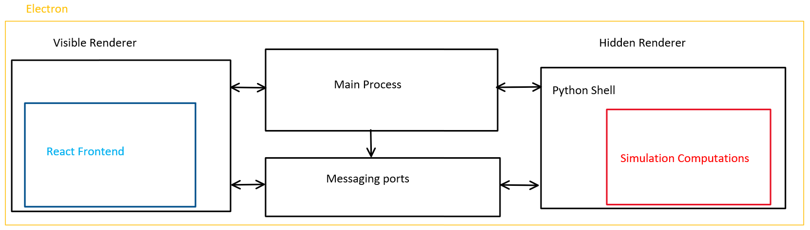

# Simulation-Client

This is the front-end side of the simulation application. The goal of this application is to display simulation outputs while allowing users to dynamically control input parameters. This application is currently a work in progress, but we envision the final product will interface with a database that contains information from the car's onboard telemetry system. This will allow our model to predict race conditions using real-time data. This application is built using a combination of Electron, React, and simple python scripts.

### Prerequisites ###

Python 3.8 or above (https://www.python.org/downloads/)

Git version control (https://git-scm.com/downloads)

nodejs (https://nodejs.org/en/download/)

### Getting Started ###

Clone this repository.

```bash
git clone https://github.com/UBC-Solar/Simulation-Client.git
```

Install node modules
```bash
npm install
```
To start the application run the command

```bash
npm start
```
This command should trigger an electron window to open with the application running. 

### General Architechture ###



This application consists of three main parts. The first one is the main process, which sends commands and passes information between the other two subprocesses. Information is passed to and from the main process using electron's messaging ports called IPC channels. More information here ( https://www.electronjs.org/docs/latest/tutorial/ipc ).
The majority of the code for the main process is found in /public/electron.js

The second process is the visible renderer. It creates and renders React components, thus containing the UI elements that the user interacts with. This is where the React portion of the applicaiton lives. Data required by UI elements must be passed to the visible render from the main process. Additionally, modular simluation parameters can be changed using UI components, and this information is passed back to the main process to be inputted into the simulation. If you aren't familiar with React, read about components here ( https://reactjs.org ). 
The code for the visible renderer process is mostly in /src/App.js

The final process is the hidden renderer. When prompted by the main process, it launches a python script using the python-shell node module, and passes simulation output data to the main process upon completion. 
The hidden process window ( an instance of electron's BrowserWindow ) is created in /public/electron.js. 
The /background_task folder contains html files that launch the python scripts.
Python scripts, which import the simulation pip package, are located in the /scripts folder.
